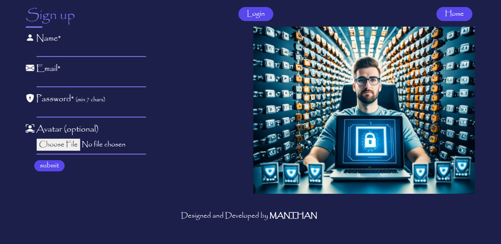
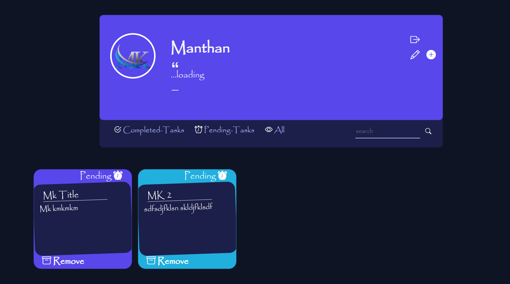

# Task Manager

A Node.js and Express.js backend application for managing tasks, featuring user authentication, CRUD operations for tasks, and MongoDB for data storage. It provides a robust API for easy integration with any frontend application.

### Project Link:

[Visit Project's Live Web-App](https://task-manager-mk.vercel.app)

## Project's Screenshots =>





## Technologies Used

- **MongoDB**: Database
- **Express.js**: Backend Framework
- **React.js**: Frontend Framework
- **Node.js**: Backend Runtime Environment
- **JWT (JSON Web Tokens)**: For secure authentication and authorization
- **Bcrypt.js**: Library for hashing passwords to enhance security.
- **Cloudinary**: Cloud service for storing and serving images
- **Docker**: Containerization tool used for deploying and running the application in different environments.

## Features

- **Task Management**: Create, Retrieve, Update and Delete tasks.
- **User Authentication**: Secure login and signup functionality using JWT (JSON Web Tokens).
- **User-Specific Tasks**: Each user can manage their own task list after authentication.
- **Secure Passwords**: Passwords are hashed and stored securely using bcrypt.
- **Data Validation**: Validation of user input (e.g., tasks, credentials) to ensure data integrity.
- **User Profiles**: Manage and update user profiles with avatars.
- **Error Handling**: Proper error responses for invalid requests and actions.
- **Pagination**: Support for paginating task results for better performance.
- **Responsive Design** : Fully responsive UI built with React.js, providing a seamless experience across all devices.

## Getting Started

To get a local copy up and running follow these simple steps.

### Prerequisites

- Git
- Node.js
- MongoDB

### Installation

1.  Install the prerequisities softwares, then

2.  Clone the repo, you can use the following the command:

    ```bash
    git clone https://github.com/mk4levi/Task-Manager.git
    ```

3.  Navigate to project directory

    ```bash
    cd Task-Manager
    ```

4.  Install dependencies

    ```bash
    npm install
    ```

5.  Create your `.env` file take reference from `sample.env`

6.  Start server

    ```bash
    npm start
    ```

    OR

    ```bash
    npm run dev
    ```

### Contact

My Portfolio - [My Portfolio](https://manthan-mk-portfolio.vercel.app/)<br>
My LinkedIn - [My LinkedIn](https://www.linkedin.com/in/mk4coder/)<br>
My Mail ID - [mksoul1811@gmail.com](mailto:mksoul1811@gmail.com)
